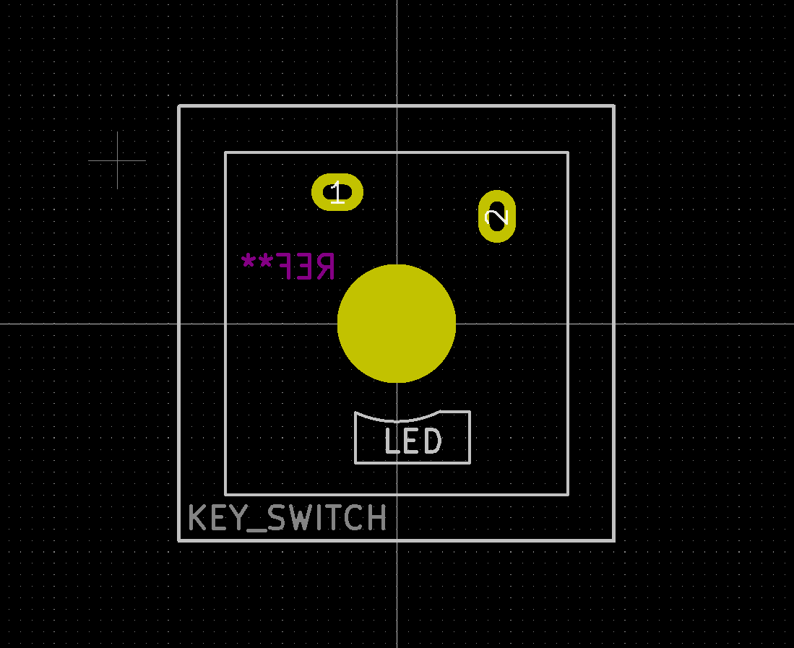

|   |name|description|
|:-:|:---|:----------|
|                        |[AE-RP2040.kicad_mod                        ](./AE-RP2040.kicad_mod                        )|[Akizuki Denshi AE-RP2040](https://akizukidenshi.com/catalog/g/gK-17542/)|
|            |[Gateron_KS-27_Hotswap.kicad_mod            ](./Gateron_KS-27_Hotswap.kicad_mod            )|Gateron KS-27 / KS-33 with hotswap sockets|
|   |[Gateron_KS-27_HotswapAndSolder.kicad_mod   ](./Gateron_KS-27_HotswapAndSolder.kicad_mod   )|Gateron KS-27 / KS-33 with hotswap sockets and soldering|
|  |[Gateron_KS-27_HotswapAndSolder2.kicad_mod  ](./Gateron_KS-27_HotswapAndSolder2.kicad_mod  )|Gateron KS-27 / KS-33 with hotswap sockets and soldering|
|             |[Gateron_KS-27_Solder.kicad_mod             ](./Gateron_KS-27_Solder.kicad_mod             )|Gateron KS-27 / KS-33 with soldering|
|           |[Seeeduino_XIAO_Reverse.kicad_mod           ](./Seeeduino_XIAO_Reverse.kicad_mod           )|used in the Joker8 macropad|
||[Waveshare_RP2040_Zero_SMD_Reverse.kicad_mod](./Waveshare_RP2040_Zero_SMD_Reverse.kicad_mod)| |
|                   |[SATA Connector.kicad_mod                   ](./SATA Connector.kicad_mod)                   | |
